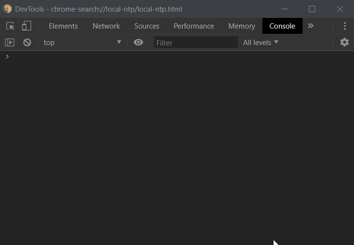

# Error Normalizer
A tool to solve the problem of multiple ecmascript error possibilities. It will normalize in single error structure.

[](https://badge.fury.io/js/ecma-error-normalizer)
[](https://travis-ci.org/lordazzi/ecma-error-normalizer)
[](https://github.com/lordazzi/ecma-error-normalizer/blob/documentation/LICENSE)

## The Problem
A throwable structure is something that can be thrown by the throw keyword, such as an application error. Unlike other languages, in JavaScript, everything is throwable.



In addition to the issue of throwable structures, there are other error structures in ecmascript, in most cases, these others are related to the servers to which the application will connect. These defects can have different structures, here [is a document](MORE-COMMON-HTTP-PROBLEMS.md) where you can read some of the more common http problems.

## The Solution
A classe that's know how to convert all errors into a single structure, a normalized structure.

## The Solution Implementation
The error converter is a structure that will centralize all solutions for all possibilities of errors in your software, and it can normalize then:

```typescript
// normalization for simple error
const errorConverter = new ErrorConverter([
  CommonErrorAdapter,
  HttpErrorAdapter
]);
const normalizedError = errorConverter.create(new Error('Some thrown error'));

// normalization for http error
const xhr = new XMLHttpRequest();
xhr.onreadystatechange = () => {
  if (xhr.readyState === 4 && Math.floor(xhr.status / 100) !== 2) {
    const errorInSameFormat = errorConverter.create(xhr);
  }
};

```

ErrorConverter will be every a singleton and all new instance will return the same instance. You can provide this class into your angular aplication, as a service, you must use a factory function for that.

### The adapter
But for the error converter know how to normalize, you must say to it using an adapter:

You will need to create adapters representing each of the possibilities of errors that may occur within your software, like this one:

```typescript
/**
 * Implement the ICustomErrorAdapter interface.
 */
export class CommonErrorAdapter implements ICustomErrorAdapter<Error> {

  /**
   * Include a single name to your adapter
   */
  name = 'thrown-error';

  /**
   * This method must check if the value should be normalized byt this class.
   * Return `true` for yes and `false` for no.
   * @param thrown
   */
  typeCheck(thrown: any): thrown is Error {
    if (thrown instanceof Error || thrown && thrown.rejection instanceof Error) {
      return true;
    }

    return false;
  }

  /**
   * Here is how the XMLHttpRequest, the NaN, the thrown Error or anything else will be
   * converted into the normalized structure
   * @param error
   */
  normalize(error: Error & { rejection: Error }): IErrorNormalized {
    let stack = '';
    if (error.message && error.stack) {
      stack = `${error.message}\n\n${error.stack}`;
    }

    if (!stack && error.rejection && error.rejection.stack) {
      const message = error.message || error.rejection.message;
      stack = `The error was caught in an unhandled promise:\n${message}\n\n${error.rejection.stack}`;
    }

    return {
      name: 'don\'t matter, this property will be override with the name of this class',
      type: 'error',
      messages: ['Some unexpected error happen inside the application'],
      techinicalMessages: [stack],
      //  this property will be override with the error
      originalInformation: null
    };
  }
}
```

For an XMLHttpRequest error, you will need to create the following signature:

```typescript
export class HttpErrorAdapter implements ICustomErrorAdapter<XMLHttpRequest> 
```

### The normalized interface

```typescript
/**
 * This is a proposal for an normalized error
 */
export interface IErrorNormalized {

  /**
   * Here is the adaptar name
   */
  readonly name: string;

  /**
   * The type will identify what should be done with the error. If it is a bussiness
   * error, I recommend extending this interface to a specific interface for business
   * errors, where a business error typing attribute must be included, so that the
   * software knows how to handle that non-conventional situation, something like this:
   *
   * interface IBusinessErrorNormalized<OriginalObject> {
   *
   *    // an enum goes nice here
   *    businessType?: 'session-timeout' | 'pending-admin-approval' | 'document-identification-is-mandatory';
   * }
   *
   * In each case the Front-End system should do somenthing, like redirect the login, show a
   * password input to collect the admin password or a modal with an input to collect the user
   * document. If the property does not exists, the business error could work exactly as the error
   * type, but should not be considered a software defect and should not have techinical messages.
   */
  type: 'error' | 'warning' | 'business';

  /**
   * Here is the error message for the system user.
   * we recommend that each line break be an item in the array (this will make it
   * easier to wrap the paragraphs tag in an html structure).
   */
  messages: string[];

  /**
   * Any thing that could help the developer to understand what happen, like the
   * response and code of and http request, a stack trace, some specific information
   * include as a log about some logical error.
   * How this information will be displayed and whether it will be displayed does not
   * matter, the important thing is that it is available.
   */
  techinicalMessages: string[];

  /**
   * Original object responsible for the error
   */
  readonly originalInformation: any;

}
```
